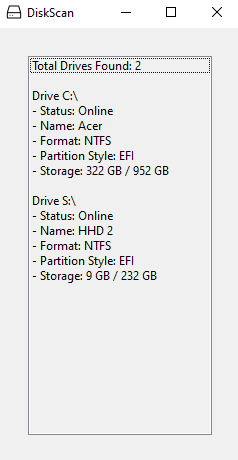

# Simple DiskScan Program

Displays the following:
- Total Drives Found:
  
- Drive letter:
- Status of Drive: (Online or offline)
- Name of Drive:
- Format of Drive: (NTFS, FAT, etc)
- Partition Style: (EFI, UEFI)
- Storage: Used storage in GB / Total storage in GB

Example of what program looks like when ran:

Was made with the Windows Form App template in Visual Studios.
